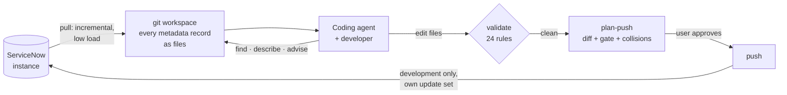

# snagentic: product overview

*For stakeholders and decision makers. Version 1.2.0, October 2026.*

## In one sentence

snagentic lets ServiceNow teams build with the coding agents developers already use (Claude
Code, GitHub Copilot, Codex, Cursor), working on the instance as files in git, with platform
guardrails enforced in code and delivery limited to development instances.

## The problem

1. **ServiceNow development is browser-bound.** Work is done one form at a time. Nobody gets
   a complete, searchable picture of what runs on a table, and nothing is reviewed before it
   is saved.
2. **AI coding agents are blind to the instance.** Agents are now the fastest way to write
   and understand code, but they can't see ServiceNow. They write scripts that duplicate or
   contradict what already runs, pick the most custom option, and ignore platform practice.
3. **Guardrails depend on people remembering them.** Best practice (no `GlideRecord` in client
   scripts, no queries in loops, no hard-coded sys_ids, least custom option first) is checked
   late, if at all, usually when an update set is reviewed before promotion.
4. **Changes are hard to trace.** Update sets record *what* changed but not why, who reviewed
   it, or how it relates to everything else on the instance.

## The solution

snagentic is one small binary that connects an instance, git and the coding agent:

1. **Mirror.** `pull` copies every metadata record (business rules, script includes, client
   scripts, UI policies, ACLs, flows, layouts, tables and fields, more than 2,000 classes) into
   a git repository with a readable, stable layout. Later pulls bring only what changed.
2. **Understand.** `find` locates anything in milliseconds. `describe` explains a table's
   behavior *in execution order*, from client scripts and UI policies to business rules
   before, after and async, notifications and ACLs, including what it inherits. It also shows
   who uses a script include or any other record.
3. **Advise.** Before building, `advise` turns a request ("notify the manager on P1",
   "make this field mandatory") into the platform's options, least custom first, with
   evidence of what already exists on those tables.
4. **Validate.** `validate` checks a change against 24 platform rules for security,
   performance, upgradability, manageability and user experience. It reports only what the
   change introduced, so legacy findings don't drown real ones.
5. **Deliver.** `plan-push` shows exactly what would change, runs the gate and detects
   records held in someone else's open update set. `push` writes that reviewed plan, and only
   that plan, into an update set named after the branch on a **development** instance, then
   verifies that each write was captured.

The agent gets all of this through one MCP server (12 tools), five workflow skills (design,
build, review, explain, deliver) and short instructions. `snagentic agent install` installs
them and registers the MCP server for Claude Code and GitHub Copilot in VS Code; the team
commits the result so everyone gets the same setup.

## Who it's for

| Audience | What they get |
|---|---|
| **ServiceNow developers** | Their editor, git and agent for ServiceNow work; answers to "what runs when I save this?" in seconds; checks while they type |
| **Technical leads and architects** | Every change as a reviewable git diff with validation results; least-custom designs by default; one shared view of the instance |
| **Platform owners and governance** | Rules enforced in code at several layers; production unreachable for writes; an audit trail in git |
| **Partners and delivery teams** | Fast onboarding on an unfamiliar instance; consistent quality across developers and agents |

## What it looks like

*Illustrative exchanges; record names are examples.*

> **Developer:** Why does the assignment group change when I save an incident?
>
> **Agent** (uses the `servicenow-explain` skill and `describe incident`): Three things run on
> save, in this order: the client script *Set assignment group* (onChange of category), the
> before business rule *Assign by category* (order 100), then the assignment rule…
> `instances/dev/metadata/global/sys_script/assign-by-category--….yaml`, line 12.

> **Developer:** Make Business service mandatory for P1 incidents.
>
> **Agent** (uses `servicenow-design`, then `advise`): The least custom option is a UI policy
> on incident with the condition priority = 1. A data policy would also enforce it on
> imports and APIs. A client script would be a last resort. Shall I build the UI policy?
> *(after approval it edits the files, runs `validate` until clean, shows the plan, and
> pushes once you confirm)*

## Proven on a real instance

Measured on a ServiceNow developer instance (PDI) from Europe to the US:

| Measure | Result |
|---|---|
| First full pull | **463,316 records** in 2,224 classes, 29 minutes, 0 retries; resumable |
| Incremental pull, nothing changed | **22 requests, 4.4 s** |
| Incremental pull, 110 changed records | 13.7 s, 66 requests |
| `describe` a table (fields + 500 behavior records in order) | about 1 s |
| `find` by name | 4 ms |
| Rule calibration | 17,026 out-of-box scripts checked in 92 s |
| Agent evaluation (Claude Code, 110 scripted runs) | 95% pass rate on behavior checks with the shipped instructions |

Sources: [pull baseline](../reports/pull-baseline-pdi.md),
[performance targets](../reports/v1.0-targets.md),
[agent evaluation](../reports/agent-eval-baseline-2026-10-06.md).

## Why it is different

| Alternative | Its limit | snagentic |
|---|---|---|
| Building in the browser (Studio, forms) | One record at a time, no review before save, no agent help | The whole instance as files; every change is a reviewed diff |
| ServiceNow's built-in AI for creators | Inside the platform and its licensing; can't use the team's own agent, editor or git process | Works with any coding agent and any git platform; nothing to install on the instance |
| ServiceNow source control integration | Works per application; changes to global and out-of-box records largely fall outside it | Mirrors every scope and class, including global |
| Generic MCP servers for ServiceNow | Live table access, often with write tools; no guardrails; high instance load | Local mirror (fast, no load), curated tools, rules enforced in code, writes only to development |
| Pasting scripts into a chat assistant | No context about what else runs; no checks | Execution-order context, advice and validation on every change |

## How it fits a team

| Mode | Pull | Push to development | Enforcement |
|---|---|---|---|
| **Solo** (personal instance) | Developer's machine | Developer's own credential | Hooks, pre-commit, push gate |
| **Team** (shared development instance) | Once, centrally (for example, a scheduled job); everyone else gets it with `git pull` | Each developer's own credential, so update sets show real authorship | The same, plus pull request review |
| **Governed** (enterprise, planned) | CI | CI on merge; agents and developers hold no write credentials | Branch protection, CI gate and promotion validation |

Instance data lives in its own workspace repository, separate from application code, and
never passes through a snagentic service: there isn't one.

## Roadmap

| Version | Scope | Status |
|---|---|---|
| 1.0 | Full and incremental sync to git, update sets, plugins, MCP server | Released 2026-10-06 |
| **1.1** | **Knowledge (`find`, `describe`), `advise`, `validate` with 24 rules, agent pack and hooks, plan and push to development** | **This release** |
| 1.2 | Table model, references and impact analysis, instance audit reports | Planned |
| 1.3 | Update-set validation before promotion, CI templates (GitHub Actions, GitLab, Azure DevOps), optional promotion guard on test and production | Planned |
| Later | Read-only production troubleshooting; premium rule packs | Planned |

## Known limits in 1.1

- Binaries aren't code-signed yet; macOS and Windows warn on first run.
- Host hooks are wired for Claude Code. Other agents use the same CLI and MCP tools, with the
  pre-commit hook and the push gate as enforcement.
- Push doesn't delete records; deactivate them instead (`active: false`).
- `describe` doesn't yet list flows and workflows triggered by a table, or business rules on
  the global table.
- Validation runs on local changes; validating an update set built in the browser comes
  in 1.3.
- Supported platforms: macOS on Apple silicon, Linux x64 and arm64, Windows x64.

## Open business decisions

- **License and commercial model:** an open core with a sealed premium rule engine is
  proposed ([ADR-0008](../adr/0008-commercial-boundary.md)). Apache-2.0 versus FSL for the core
  is still to be decided.
- **Code signing:** an Apple Developer account and a Windows code-signing certificate.
- **Distribution:** a Homebrew tap.

## Learn more

- [Security and governance](security-and-governance.md): data flows, credentials and
  enforcement layers, for security reviewers.
- [Getting started](../getting-started.md) and the [command reference](../reference/commands.md).
- [Credentials and instance trust](../guides/credentials.md): how passwords are stored and
  bound to one instance.
- [Architecture decisions](../adr/README.md) and [requirements](../architecture/significant-requirements.md).
