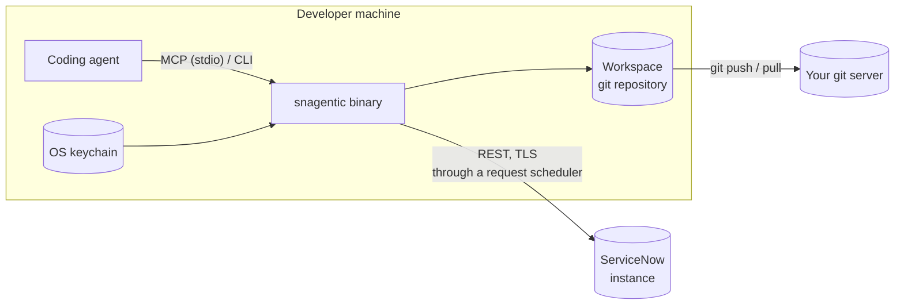

# snagentic: security and governance

*For security, architecture and platform reviewers. Version 1.1.0.*

This document explains where instance data goes, how credentials are handled, what can
write to ServiceNow, and which controls are enforced in code rather than left to an agent.
Each statement links to the decision record (ADR) behind it.

## Architecture at a glance

- **One self-contained binary** on the developer's machine (and later in CI). There's no
  snagentic server, cloud service or telemetry ([ADR-0004](../adr/0004-deployment-topology.md)).
- **Agents talk to the binary over stdio** (MCP) or by running the CLI. They never receive
  instance credentials.
- **Instance data** goes to the workspace git repository, which is separate from application
  code, and from there to your git server. What a coding agent reads goes to that agent's
  model provider under your agreement with it. snagentic doesn't send data anywhere else.

## What is stored on disk

| Stored | Not stored |
|---|---|
| Metadata records (`sys_metadata` classes): scripts, configuration, child rows such as flow steps and layouts | Business records (incidents, users, CMDB data) |
| Plugin and store app inventory | Password fields: fields of a password type, and fields with secret names, are never written |
| A local search index, rebuilt from the files at any time | System property values, unless a property is explicitly allow-listed and its name doesn't look like a secret |
| Push plans and a push journal (local state, not committed) | Credentials of any kind |

Redaction happens before anything is written. A field that was redacted can't be pushed back;
the plan tells the user to set it on the instance. An update set export leaves out the updates
that would set a secret, and lists them so they can be moved by hand.

## Credentials

- Stored only in the **OS keychain** (macOS Keychain, Windows Credential Manager, Linux Secret
  Service) or in **environment variables** for CI. Never in files, logs, error messages or
  commits.
- Each developer uses their **own** ServiceNow account, so update sets and audit history show
  real authorship.
- `snagentic doctor --instance <name>` checks connection, roles and timestamp handling.

## Instance kinds: production is read-only by construction

Every instance profile has a kind: `development`, `test` or `production`
([ADR-0012](../adr/0012-production-read-only-by-construction.md)).

| | development | test, production |
|---|---|---|
| Pull, status, update sets (read) | yes | yes |
| `push`, `plugins activate` | yes, gated | **not registered**: the commands and MCP tools don't exist for these instances |
| Credential requirement | normal developer roles | must hold `snc_read_only`; checked **before every connection**, refused otherwise |
| Adding the profile | — | needs an explicit `--acknowledge-read-only` |

snagentic never uses "reads" that write: no background scripts, debug properties, job or
flow execution, cache flushes or impersonation.

## The write path

Only `push` (and plugin activation) writes to an instance, and only to a development
instance. A push needs every one of these:

1. **A plan id** from `plan-push`, bound to the exact content of the workspace. If anything
   changes after planning, the push is refused.
2. **A passing gate:** `validate` finds no blocking finding, or each one is covered by a
   waiver in `waivers.yaml` with a rule, path, reason, approver and expiry date. Waivers are
   reviewed in git like any other change.
3. **Explicit confirmation** (`--confirm`). MCP hosts ask the user first because the tool is
   marked destructive.
4. **An unchanged remote base:** each record is compared with the version last pulled. If
   someone changed it on the instance since then, the push stops.
5. **No collisions** with records held in another open update set, unless overridden
   explicitly.

The push writes into its own update set, `snagentic: <branch> [<scope>]`, restores the user's
current update set afterwards, journals each step before writing, verifies each write was
captured, and never retries a write automatically. Push doesn't delete records.

## Enforcement layers

Skills and instructions guide an agent; **they never count as enforcement**
([ADR-0011](../adr/0011-enforcement-layers.md)). Guarantees come from code, credentials, git
and CI:

| # | Layer | What it stops | 1.1 |
|---|---|---|---|
| 1 | Host hooks: refuse edits to protected files (including the hook settings themselves), `check` after each edit, `validate` before the agent ends its turn | Agent mistakes, immediately | Claude Code, Copilot CLI |
| 2 | Host permission rules and a shell hook: deny direct HTTP to the instance, deny skipping git hooks, ask before `push` | The agent working around snagentic | Claude Code; Copilot CLI (shell hook, no `ask`) |
| 3 | Push gate (above) | Unvalidated pushes through the tool | **Yes** |
| 4 | Git pre-commit hook running `validate` | Bad commits | **Yes** |
| 5 | Git server branch protection and CI checks | Anything merged, whoever wrote it | 1.3 (templates) |
| 6 | Credential isolation: in governed mode only CI can write | Every direct-API bypass | 1.3 |
| 7 | Update-set validation in CI before promotion | Browser-built work promoted through CI | 1.3 |
| 8 | ServiceNow roles, checked by `doctor`; `snc_read_only` for test and production | What a credential can do at all | **Yes** |
| 9 | Optional promotion guard app on test and production | Everything, including manual promotion | Planned |

Hooks fail open, so a broken hook never blocks a developer. That is acceptable because the
push gate and the git hooks hold regardless. Copilot CLI reads the hooks from
`.claude/settings.json`; it does not apply Claude Code's permission rules, so the shell hook
refuses the same commands. The shell hook matches command text, so it stops an agent's
mistakes, not a determined bypass; layers 3 to 9 cover that. VS Code runs these hooks only
with `chat.useClaudeHooks` enabled, and the Copilot cloud agent doesn't run them.

## Guardrail content

`validate` applies 24 rules, each with an id, severity, rationale and remediation, in five
categories:

- **Security**, for example no dynamic code evaluation, no credentials in scripts, no
  concatenated encoded queries, no ACL scripts that grant unconditionally.
- **Performance**, for example no queries inside loops, no `GlideRecord` or synchronous
  calls in client scripts, no `current.update()` in business rules.
- **Upgradability**, for example no DOM manipulation in client scripts. *Prefer not to modify
  out-of-box records* is listed but not checked yet.
- **Manageability**, for example new scripts need a description, and scripts must parse.
- **User experience.**

Only findings a change introduces are reported; what already exists in the base version is
left out, matched by rule, field and line. Lines flagged as containing credentials are masked
in every finding.

## Load on the instance

Instance load is treated as a product requirement
([ADR-0016](../adr/0016-instance-load-and-pagination.md)): keyset paging (no offsets, no row
counts), named fields only, filters on indexed fields only, and one scheduler per instance
that limits concurrency and rate and honors `Retry-After`. Measured on a PDI: an incremental
pull with no changes costs 22 requests and 3.2 s of server time.

## Supply chain

- Release binaries are built by GitHub Actions from a tag, with `SHA256SUMS` and GitHub build
  provenance attestations. The install scripts check the checksum before installing.
- Not yet: Apple notarization and Windows code signing.
- Few runtime dependencies; each new dependency must be justified in its commit.

## Open items

- **Spike S6:** an in-depth confirmation of `snc_read_only` behavior across ServiceNow
  releases. The check already ships, but this confirmation is needed before production
  troubleshooting features are built.
- Hooks for VS Code without `chat.useClaudeHooks`, the Copilot cloud agent and Codex.
- Code signing.
